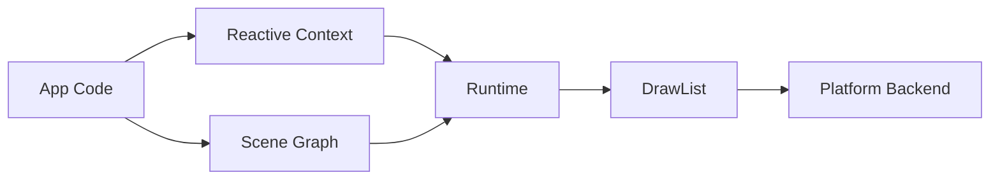

# Aethium

A minimal, high-performance UI framework where the **UI is written entirely in Go**, rendered via an **immediate-mode canvas**, and deployed to both browser (Wasm) and native desktop targets.

---

## Project Status: Stage 2 (Live & Working)

Aethium is currently in **Stage 2 of development**. This is not just a specification; the repository contains a fully functional core runtime and reactive system.

- **Working Examples**: Check out [examples/hello](examples/hello) and [examples/todo](examples/todo) to see the framework in action.
- **Current Focus**: Optimization, bug fixes, and expanding the canvas primitive set.

---

## Framework Overview

| Feature | Browser (Wasm) | Desktop (Native) |
|---------|----------------|------------------|
| **Toolchain** | TinyGo 0.34.0 | Go 1.22+ |
| **Binary Size** | ≤ 500 KB (gzipped) | ≤ 5 MB |
| **Rendering** | WebGL2 Canvas | System WebView (WebView2/WebKit) |
| **Threading** | Single-threaded | Main thread (UI) + Background Workers |

---

## Why Aethium? (The Go-First Model)

Aethium's key differentiator is its **unified Go programming model**. Unlike other frameworks that force a split between "frontend" (JS/TS) and "backend" (Go/Rust), Aethium lets you build the entire application, including the UI, in pure Go.

### Comparison Table

| Feature | Aethium | Wails | Tauri | Electron |
|---------|---------|-------|-------|----------|
| **UI Language** | **Go** | JS / TS / CSS | JS / TS / CSS | JS / TS / CSS |
| **Backend Language**| **Go** | Go | Rust | JS / TS (Node) |
| **Rendering Model** | Immediate Canvas | Web DOM | Web DOM | Web DOM |
| **Binary Size** | **Ultra Small** (≤ 5MB) | Small (~10-20MB) | Small (~10-20MB) | Large (120MB+) |
| **JS Engine** | **None** | Required | Required | Required |

---

## Core Principles

- **Single Codebase**: Write once in Go, run on the web and desktop with identical visuals.
- **Immediate-Mode**: No DOM, no widget tree. Pure draw command stream for maximum performance.
- **Fine-Grained Reactivity**: Signal-based updates ensure only the necessary parts of the UI re-render.
- **Zero Dependencies**: The core framework is built entirely on the Go standard library and JS built-ins.

---

## Quick Start

```bash
# Install the CLI
go install github.com/A-Solo-Engineer/aethium/cmd/aethium@latest

# Create a new project
aethium new --module example.com/myapp

# Build for your target
aethium build --target desktop  # For Windows/macOS/Linux
aethium build --target wasm     # For the Web
```

---

## Documentation

| Guide | Description |
|-------|-------------|
| [Architecture](docs/ARCHITECTURE.md) | Technical design, rendering strategy, and system diagrams. |
| [State Management](docs/STATE_MANAGEMENT.md) | Signals, computed values, effects, and memory pooling. |
| [Usage Guide](docs/USAGE.md) | API reference, component lifecycle, and examples. |
| [Build System](docs/BUILD_SYSTEM.md) | TinyGo optimizations and platform-specific build flags. |

---

## Project Structure



---

## License

AGPL-3.0
