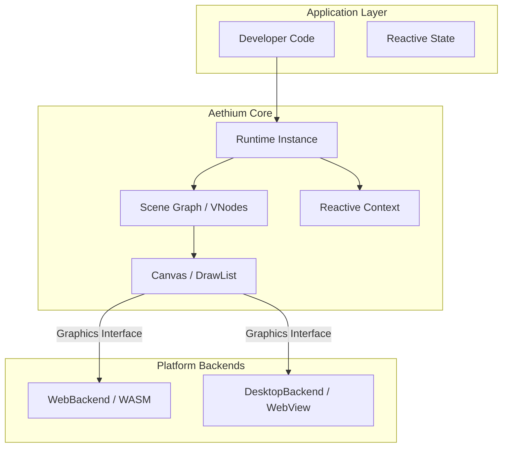

# Aethium — Architecture

Binding technical decisions for the Aethium framework.

---

## Core Philosophy: The "Unified Canvas"

Aethium operates on a **Unified Canvas** principle. Whether running in a browser or on a desktop, the application logic remains identical.

### High-Level Architecture Overview

| Component | Responsibility | Environment |
|-----------|----------------|-------------|
| **App Logic** | Component hierarchy, state, and business logic. | Pure Go / TinyGo |
| **Reactive Core** | Signal-based dependency tracking and updates. | Pure Go |
| **Scene Graph** | Retained tree of virtual nodes (`VNodes`). | Pure Go |
| **Canvas API** | Immediate-mode draw command generation. | Pure Go |
| **Platform Bridge**| Environment-specific rendering (WebGL, WebView). | JS / OS Native |

---

## Instance-Based Design

A major Stage 2 refinement was moving from **Global State** to **Instance-Based Contexts**. This allows multiple Aethium runtimes to run side-by-side in a single process.

### Global vs. Instance Context

| Feature | Global Context (Stage 1) | Instance Context (Stage 2) |
|---------|-------------------------|----------------------------|
| **Multi-App Support** | Impossible (shared signals) | Supported (isolated contexts) |
| **Thread Safety** | Contention on global mutexes | Mutexes scoped to instance |
| **Testing** | Difficult (state leaks between tests) | Easy (fresh context per test) |
| **API Entry** | `reactive.NewSignal()` | `runtime.Reactive().NewSignal()` |

---

## Rendering Strategy

**Primary approach: Immediate-mode command stream executed via the `Graphics` interface.**

The developer describes UI each frame as a retained **scene graph**, but the **output** is an immediate-mode stream of draw commands (`FillRect`, `DrawText`, etc.).

### The `Graphics` Interface

To decouple the framework from platform specifics, we introduced a pluggable rendering interface:

```go
type Graphics interface {
    FillRect(x, y, w, h float32, color Color)
    StrokeRect(x, y, w, h float32, color Color)
    DrawText(x, y float32, text string, color Color)
    SetClip(x, y, w, h float32)
    SetTransform(matrix [6]float32)
}
```

---

## System Diagram



---

## Concurrency & Scheduling

Aethium uses a **Non-Blocking UI Queue** to handle asynchronous updates safely.

### The Update Loop

| Step | Action | Thread |
|------|--------|--------|
| 1 | `ScheduleOnUI(fn)` | Any |
| 2 | `drainUIQueue()` | UI Thread (Start of Tick) |
| 3 | `reactive.Notify()` | UI Thread |
| 4 | `runtime.buildFrame()`| UI Thread |
| 5 | `backend.Render()` | UI Thread |

---

## Implementation Deviations from Stage 1 Spec

| Decision | Stage 1 Spec | Stage 2 Reality | Reason |
|---|---|---|---|
| State Scope | Global variables | `reactive.Context` & `scene.Context` | Enable multi-instance support and cleaner testing. |
| Rendering | Direct backend calls | `canvas.Graphics` Interface | Better abstraction for future backends (Metal/Vulkan). |
| Signal Types| `comparable` only | `any` with `WithEquality` | Support for slices (Todo lists) and complex structs. |
| UI Queue | Fixed-size Channel | Mutex-protected Slice | Prevent deadlocks during massive state updates. |

---

## Consistency references

| Topic | Document |
|-------|----------|
| Signals, pools | [STATE_MANAGEMENT.md](STATE_MANAGEMENT.md) |
| CLI, TinyGo flags | [BUILD_SYSTEM.md](BUILD_SYSTEM.md) |
| License | [VISION.md](VISION.md) (AGPL-3.0) |
