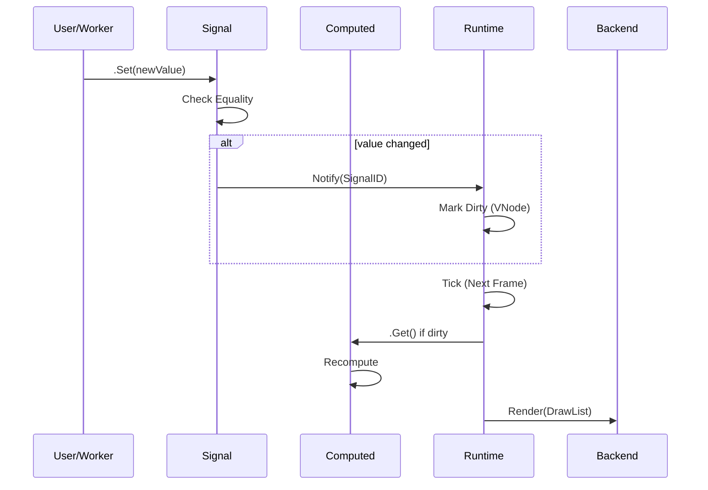

# Aethium — State Management

Binding decisions for reactivity, memory, derived state, and concurrency safety.

---

## Reactivity Model: Fine-Grained Signals

Aethium uses **Signal-based reactivity**. Unlike virtual DOM frameworks, Aethium does not diff trees. Instead, it maintains a precise graph of dependencies.

### Why Signals?

| Feature | Aethium Signals | Virtual DOM (React) |
|---------|-----------------|---------------------|
| **Update Scope** | Only affected components | Full subtree by default |
| **CPU Cost** | $O(1)$ on update | $O(N)$ on update |
| **GC Pressure** | Minimal (pooled objects) | High (VNode churn) |
| **Simplicity** | Explicit dependencies | Magic hooks/proxies |

---

## Signal Types & Constraints

Aethium supports both simple and complex state types.

### Type Support Matrix

| Type Category | Support | Equality Check | Example |
|---------------|---------|----------------|---------|
| **Comparable** | Native | `a == b` | `int`, `string`, `bool` |
| **Slices** | Supported | Custom / Always Dirty | `[]*TodoItem` |
| **Structs** | Supported | Custom / Always Dirty | `UserConfig{}` |
| **Pointers** | Supported | Pointer Identity | `*Session` |

### Custom Equality with `WithEquality`

For complex types, you can optimize updates by providing a custom equality function:

```go
todos.WithEquality(func(a, b []*TodoItem) bool {
    return len(a) == len(b) // Simple example
})
```

---

## Data Flow Lifecycle



---

## The `Context` API

Reactivity is scoped to a `reactive.Context`. This ensures that signals from different app instances do not collide.

### Context Ownership

- **Runtime Context**: Each `runtime.Runtime` instance creates its own `reactive.Context`.
- **Default Context**: A global context exists for simple scripts or single-app environments.

```go
// Preferred: Use the runtime's context
signal := reactive.NewSignalWithContext(rt.Reactive(), initialValue)

// Shortcut: Uses DefaultContext
signal := reactive.NewSignal(initialValue)
```

---

## Memory Strategy: Pooling

Aethium uses `sync.Pool` aggressively to keep GC pauses under 1ms.

| Pooled Object | Usage | Package |
|---------------|-------|---------|
| **VNode** | Tree structure elements | `scene` |
| **DrawList** | Batched draw commands | `canvas` |
| **UI Tasks** | Scheduled closures | `runtime` |

---

## Implementation Deviations from Stage 1 Spec

| Decision | Stage 1 Spec | Stage 2 Reality | Reason |
|---|---|---|---|
| Generics | `comparable` only | `any` support | Enable reactive slices (e.g., Todo lists). |
| Context | Global only | Instance-based `Context` | Support multi-window/multi-app scenarios. |
| Mutex | `sync.Mutex` | `sync.RWMutex` | Optimize for read-heavy UI workloads. |
| Effects | `NewEffect()` | `NewEffectWithRuntime()` | Ensure thread-safety via `ScheduleOnUI`. |
